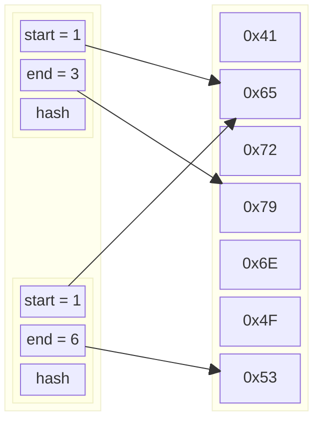

The Index record isolates a region of a Content record. This is especially useful
when the Content's blob is composed of heterogenous data that must be managed separately.

The Index record does not specify which Content record it refers to; applications
may use custom logic to disambiguate the correct record (e.g., a *stone* may be encoded
with Index records followed by the Content they refer to). The trivial case is a *stone*
with only one Content record.

| Field | Type | Size (bytes) | Description |
|---|---|---|---|
| start | uint | 8 | The offset in the Content blob where this region begins. This is a zero-based index: the first byte is addressed with 0. |
| end | uint | 8 | The offset in the Content blob where this region ends. This last byte is included in the range. This is a zero-based index: the first byte is addressed with 0. |
| hash | blob | 16 | Checksum of the content of the region, computed using <a href="https://xxhash.com">XXH3_128bits</a>. |

Illustrated below is an example of two Index records addressing the same Content.

