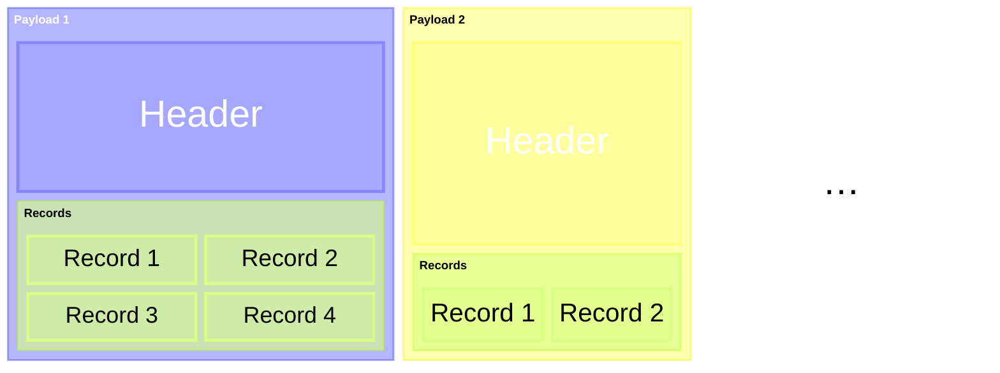

import DirectoryList from '@components/DirectoryList.astro';

The v1 of the Stone format is the version currently employed by AerynOS, and is the first revision of our format.

:::tip
The contents below extend the version-agnostic components of the Stone format.
Readers are encouraged to read the <a href="/developers/stone/">Stone format overview</a> first.
:::

v1 revolves around the concept of records.\
A payload contains one or more records, all of the same type, which specified in the payload's sub-header;
the record's type describes the information it carries.\
Records within a payload may be compressed as a whole archive (not individually) using [Zstandard](https://facebook.github.io/zstd/).\
With the exception of the <a href="/developers/stone/v1/record/content">Content</a> record, all records have a fixed size determined by their type, or have a preamble that reveals the final size.
The Content record is unique in that it spans the entire payload and must be the only record it contains.

<DirectoryList/>
