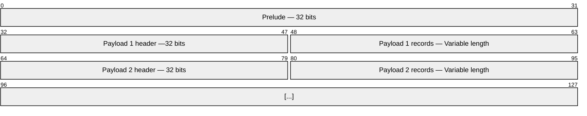

import DirectoryList from '@components/DirectoryList.astro';

The Stone format is a binary format designed to be type-safe and version-aware.
It is used to package and distribute software in AerynOS, in fact both the very packages and the index
file of repositories use the Stone format.

Anything encoded in the Stone format is called a *stone*.
Each *stone* is composed of a Prelude (the global header) and zero or more payloads, each with its own sub-header.
No limit is set for the length of a *stone*, but it will always be at least 32 byte long, that is the size of
the Prelude.

The fundamental types of the Stone format are integer numbers and strings.

| Type | Format | Length (in bytes) | Description | Abbreviation|
|---|---|---|---|---|
| Signed integer | Big-endian | Various | Integer number with a sign. When negative, two's complement is used. The range of values goes from -2^(n-1) to 2^(n-1)-1, where `n` is the number of bytes. |uint|
| Unsigned integer | Big-endian | Various | Integer number without a sign. The range of values goes from 0 to 2^(n)-1, where `n` is the number of bytes. |int|
| String | UTF-8 | Various | A string of text, without the NULL termination. |str|

The documentation will delve into the details of each section in the next pages.

<DirectoryList/>
